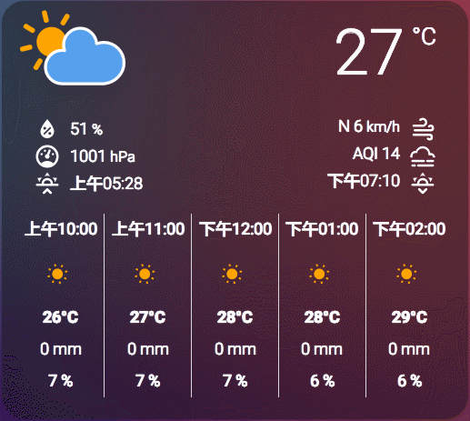

# Qweather card
[](https://github.com/hacs/integration)

Added Qweather support with hourly forecast compatibility.

Works well with [和风天气 Home Assistant 插件](https://github.com/cheny95/qweather).

Originally created for the [old UI](https://community.home-assistant.io/t/custom-ui-weather-state-card-with-a-question/23008) converted by @arsaboo and @ciotlosm to [Lovelace](https://community.home-assistant.io/t/custom-ui-weather-state-card-with-a-question/23008/291) and now converted to Lit to make it even better.

This card uses the awesome [animated SVG weather icons by amCharts](https://www.amcharts.com/free-animated-svg-weather-icons/).



Thanks for all picking this card up.

## Installation:
### Install with HACS (Recommended)

Add `https://github.com/scythk/lovelace-qweather-card` to HACS Custom repositories and install.

### Manual

1. Download the [weather-card.js](./dist/weather-card.js) to `/config/www/community/lovelace-qweather-card/`.
2. Save the [amCharts icons](https://www.amcharts.com/free-animated-svg-weather-icons/) (The contents of the folder "animated") under `/config/www/community/lovelace-qweather-card/icons/`
3. If you use Lovelace in storage mode, and want to use the editor, download the [weather-card-editor.js](./dist/qweather-card-editor.js) to `/config/www/community/lovelace-qweather-card/`.

Add the following to resources in your lovelace config:

```yaml
resources:
  - url: /hacsfiles/lovelace-qweather-card/qweather-card.js
    type: module
```

## Configuration:

And add a card with type `custom:qweather-card`:

```yaml
type: custom:qweather-card
entity: weather.yourweatherentity
name: Optional name
```

If you want to use your local icons add the location to the icons:

```yaml
type: custom:qweather-card
entity: weather.yourweatherentity
icons: "/local/community/lovelace-qweather-card/icons/"
```

You can choose which elements of the weather card you want to show:

The 3 different rows, being:

- The current weather icon, the current temperature and title
- The details about the current weather
- The X day forecast or hourly forecast

```yaml
type: custom:qweather-card
entity: weather.yourweatherentity
current: true
details: false
forecast: true
hourly_forecast: true
number_of_forecasts: 5
```

If you want to show the sunrise and sunset times, make sure the `sun` component is enabled:

```yaml
# Example configuration.yaml entry
sun:
```

### Qweather:

See [和风天气 Home Assistant 插件](https://github.com/cheny95/qweather) for details.

```yaml
# Example configuration.yaml entry
weather:
  - platform: qweather
    name: WEATHER_ENTITY_NAME
    api_key: YOUR_API_KEY
    location: YOUR_LOCATION
    default: 7
    scan_interval: 600
```
